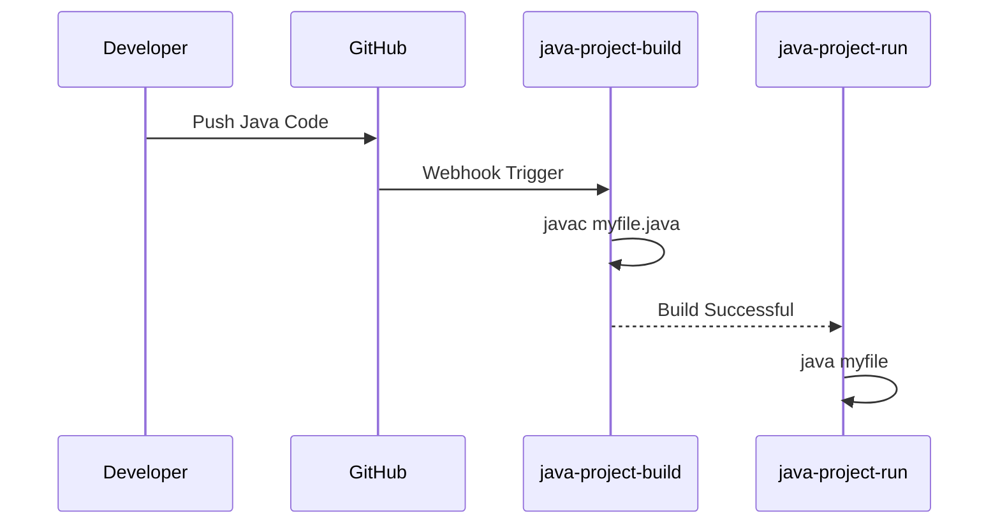
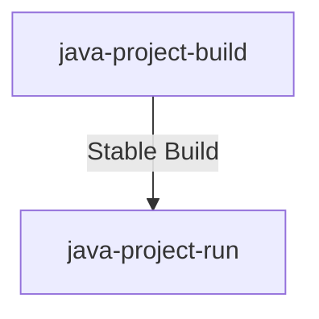
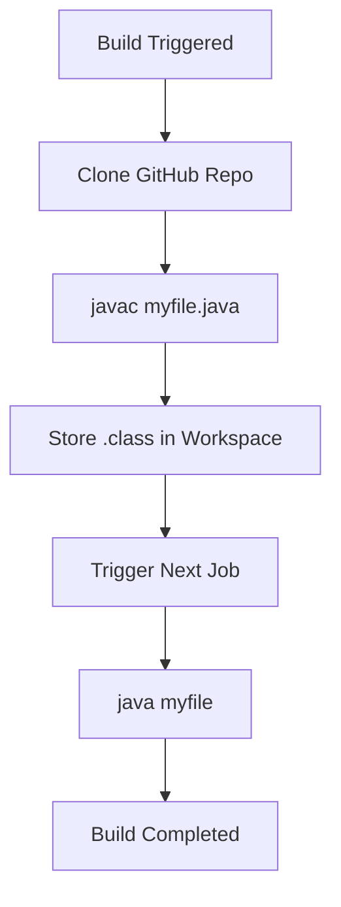
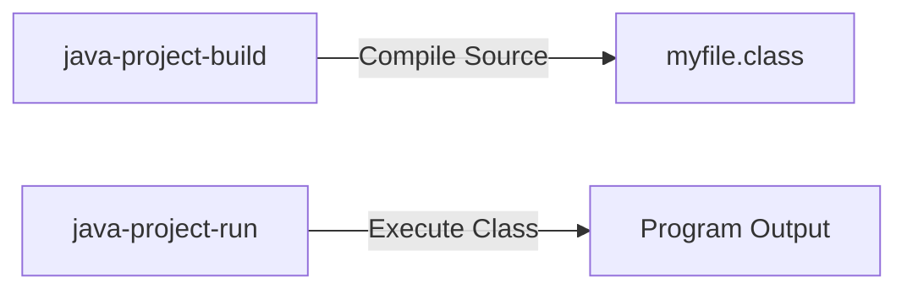

# 🚀 Java CI/CD Automation Using Jenkins & GitHub

An **end-to-end DevOps CI/CD project** demonstrating how to build and run a **core Java application** using **multiple Jenkins jobs**, **GitHub Webhooks**, and **upstream/downstream triggers**.

This project focuses on **real-world Jenkins automation**, starting from **manual file creation on the Jenkins server** to **job chaining and workspace management**.

---

## 👤 Project Owner :-

**Name:** Prasad Bhoite  
**Role:** Cloud & DevOps Engineer (Fresher)  
**Tools:** Java · Jenkins · GitHub · Linux (Ubuntu)

---

## 📌 Project Overview :-

This repository demonstrates a **two-stage Jenkins job pipeline**:

1. **java-project-build**
   - Compiles Java source code
   - Stores compiled files in Jenkins workspace

2. **java-project-run**
   - Triggered only after successful build
   - Executes the compiled Java application

- Automation is achieved using:
  - GitHub Webhooks
  - Jenkins Freestyle Jobs
  - Upstream & Downstream job triggers

---

## 🎯 Project Objectives :-

- Understand Jenkins workspace behavior
- Automate Java builds using Jenkins
- Implement job chaining (Build → Run)
- Learn GitHub Webhook integration
- Practice real CI/CD interview-level concepts

---

## 🧱 Project Architecture :-
```
Jenkins Server
│
├── java-project-build
│ └── Compiles myfile.java
│
├── java-project-run
│ └── Executes compiled Java class
│
└── GitHub Repository
└── myfile.java
```
---

## ⚙️ Prerequisites :-

- Ensure the following are installed on the **Jenkins server**:

  - Java (JDK 8 or above)
  - Jenkins
  - Git
  - GitHub account
  - Internet access (Webhook)

---

### 📂 Step 1: Create Project Directory on Jenkins Server :-

```bash
mkdir java-project
```
```bash
cd java-project
```

### 📄 Step 2: Create Java Source File :-

```bash
touch myfile.java
```

- Sample Java Code (myfile.java)
  
```java
public class myfile {
    public static void main(String[] args) {
        System.out.println("Java project built and executed using Jenkins!");
    }
}
```

### 🔍 Step 3: Test Java File Manually (Optional but Recommended) :-

```bash
javac myfile.java
```
```bash
java myfile
```
### 🗃 Step 4: Push Code to GitHub :-

```bash
git init
```
```bash
git add .
```
```bash
git commit -m "Initial Java project for Jenkins CI/CD"
```
```bash
git branch -M main
```
```bash
git remote add origin <your-github-repo-url>
```
```bash
git push -u origin main
```

### 🔧 Step 5: Create Jenkins Job – java-project-build :-

- Job Configuration :

  - Job Type: Freestyle Project
  - Source Code Management: Git
  - Repository URL: GitHub repo URL
  - Trigger: GitHub hook trigger for GITScm polling
  - Build Step → Execute Shell
  
```bash
javac myfile.java
```
- ✔ Compiles Java source file
- ✔ Output stored in Jenkins workspace

### 🗂 Jenkins Workspace After Build :-

```text
/var/lib/jenkins/workspace/java-project-build/
├── myfile.java
└── myfile.class
```

### 🔧 Step 6: Create Jenkins Job – java-project-run :-

- Job Configuration :
  - Job Type: Freestyle Project
  - Build Trigger: Build after other projects are built
  - Upstream Project: java-project-build
  - Trigger Condition: Stable build
  - Build Step → Execute Shell
```bash
java myfile.java
```

- ✔ Executes compiled Java program
- ✔ Uses same workspace artifacts

## 🔁 Jenkins Job Chaining Flow :-


---

## 🔁 Jenkins Job Dependency (Upstream → Downstream)



## 📂 Jenkins Workspace Lifecycle


## ⚙️ Build vs Run Job Responsibilities



## 🔗 GitHub Webhook Configuration :-

- GitHub Repository :
  - Go to Settings → Webhooks
  - Payload URL:
``` text
http://<jenkins-ip>:8080/github-webhook/
```
- Content Type: application/json
- Jenkins
- Enable GitHub hook trigger for GITScm polling

## 🧠 Jenkins Workspace Behavior :-

- Each Jenkins job has its own workspace
- Downstream job reuses compiled files
- Workspace persists unless cleaned manually

## 🚨 Failure Handling Logic :-

- ❌ Compilation fails → Run job not triggered
- ❌ Java runtime error → Pipeline stops
- Logs available in Jenkins Console Output

## 🌐 Real-World Use Case :-

- This pipeline structure is commonly used for:
- Core Java applications
- Java microservices
- Internal automation tools
- Enterprise CI/CD workflows

## 🧠 DevOps Interview Talking Points :-

- Difference between build & run jobs
- Jenkins upstream/downstream triggering
- Workspace artifact reuse
- Webhook vs polling
- CI vs CD

## 📌 Key Takeaways :-

- CI/CD is about automation + reliability
- Jenkins job chaining mimics real pipelines
- Webhooks provide instant builds
- Clean structure improves maintainability
  
## 🚀 Future Enhancements :-

- Convert to Declarative Jenkins Pipeline
- Add Maven or Gradle
- Add Docker image build
- Deploy to AWS EC2
- Add email notifications

## 🏁 Final Notes :-
This project is resume-ready, interview-ready, and production-aligned.

If you can explain and build this project, you understand real Jenkins CI/CD fundamentals 💪

🔥 Happy Automating with Jenkins! 🔥

## 📩 Connect With Me :
If you’d like to collaborate, discuss projects, or just say hello — feel free to reach out!  

### 🔗 Social & Professional Links:
- 🌐 [Portfolio Website](https://prasad-bhoite19.github.io/prasad-portfolio/)  
- 💼 [LinkedIn](http://linkedin.com/in/prasad-bhoite-a38a64223)  
- 🐙 [GitHub](https://github.com/Prasad-bhoite19)  
- ✉️ [Email](prasadsb2002@gmail.com)  
